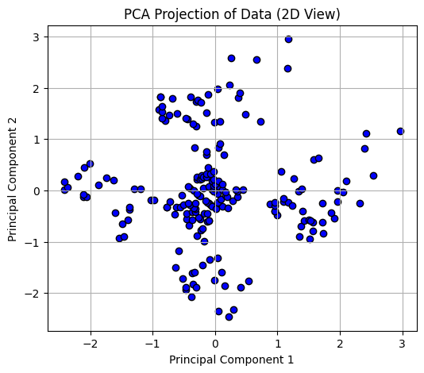
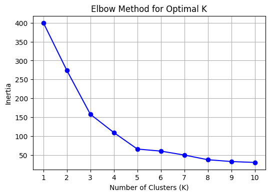

# 🔍 Task 8: Clustering with K-Means

## 📚 Objective

Perform unsupervised machine learning using the **K-Means Clustering algorithm** to group customers based on features like Annual Income and Spending Score.

---

## 📁 Dataset

**Dataset Name:** Mall Customer Segmentation  
**Source:** [Kaggle Dataset](https://www.kaggle.com/datasets/vjchoudhary7/customer-segmentation-tutorial-in-python)

---

## 🛠 Tools & Libraries Used

- Python
- Pandas
- NumPy
- Matplotlib
- Seaborn
- Scikit-learn

---

## 🔧 Steps Performed

### ✅ 1. Load and Visualize Dataset (with optional PCA)

- Loaded the dataset from GitHub
- Selected key features: `Annual Income` and `Spending Score`
- Scaled the data using `StandardScaler`
- Applied **PCA** for 2D visualization

---

### ✅ 2. Fit K-Means and Assign Cluster Labels

- Fit KMeans with 5 clusters
- Added predicted cluster labels to the original dataset

---

### ✅ 3. Use the Elbow Method to Find Optimal K

- Iterated through values of K from 1 to 10
- Plotted inertia vs K to find the 'elbow' point

📉 **Elbow indicates optimal K = 5**

---

### ✅ 4. Visualize Clusters with Color-Coding

- Used `Seaborn` to scatter plot clusters based on KMeans labels
- Each color represents one cluster (5 total)

---

### ✅ 5. Evaluate Clustering Using Silhouette Score

- Calculated the **Silhouette Score** for cluster validity  
- Score obtained: `0.5547` at `K = 5` indicating fairly well-separated clusters

---

## 📌 Key Concepts Covered

- **K-Means Clustering**: Partitioning method to group similar data points
- **Elbow Method**: Helps decide optimal number of clusters (K)
- **PCA**: Dimensionality reduction for visualization
- **Silhouette Score**: Validity measure of clustering
